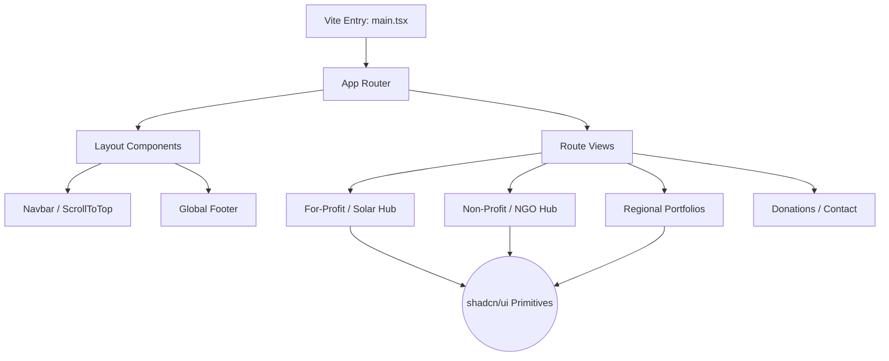

### Repository Metadata

**GitHub Repository Description**
The official web portal for Rao Sewa Nyas, showcasing their dual-model organization, solar energy initiatives, and regional community impact.

**Elevator Pitch**
The Rao Sewa Nyas (RSN) web portal is a modern, high-performance web application built to serve as the digital face of the organization. Engineered with a React, Vite, and TypeScript stack, the platform elegantly bridges RSN's for-profit solar energy solutions with their non-profit community services. By offering an accessible, responsive interface featuring regional portfolio galleries, transparent credentialing, and donation facilitation, the repository provides a scalable frontend architecture tailored for enterprise and NGO visibility.

**GitHub Topics**
`react`, `vite`, `typescript`, `tailwind-css`, `shadcn-ui`, `solar-energy`, `ngo`, `corporate-website`, `spa`, `frontend-architecture`

---

### Complete README.md

```markdown
# Rao Sewa Nyas Web Portal ☀️

> The official digital presence bridging renewable energy solutions with community impact.


## 📖 Overview

**Rao Sewa Nyas (RSN)** operates on a unique dual-model structure, balancing a robust For-Profit energy solutions sector with a dedicated Non-Profit community service wing. Presenting these distinct but interconnected identities clearly to the public requires a highly organized digital layout.

This repository houses the frontend web application that solves this communication challenge. It provides specialized routing for commercial solar portfolios (specifically in regions like Lucknow and Deoria) alongside dedicated spaces for donations, partnerships, and organizational credentials.

## ✨ Features

- **Dual-Model Navigation:** Seamlessly routes users between the For-Profit (Solar/Energy) and Non-Profit (NGO) aspects of the organization.
- **Regional Portfolios:** Dedicated showcase pages for specific operational zones, including Deoria and Lucknow.
- **Trust & Verification:** Integrated views for organizational credentials, team directories, and partner networks.
- **Accessible UI/UX:** Built on Radix UI primitives via `shadcn/ui` to ensure strict accessibility standards and keyboard navigation.
- **Performance First:** Lightning-fast page loads and Hot Module Replacement (HMR) powered by Vite.

## 🛠️ Tech Stack

| Category | Technology | Description |
| :--- | :--- | :--- |
| **Framework** | React 18 | Core UI rendering library |
| **Build Tool** | Vite | Next-generation frontend tooling |
| **Language** | TypeScript | Strictly typed JavaScript for enterprise reliability |
| **Styling** | Tailwind CSS | Utility-first CSS framework |
| **Components** | shadcn/ui | Reusable component system based on Radix UI |
| **Deployment** | Vercel | Pre-configured via `vercel.json` for edge-network hosting |

## 📐 Architecture

The platform operates as a statically routed Single Page Application (SPA). By leveraging React Router, the application abstracts complex navigation paths while maintaining a unified layout structure. Utility functions manage error capturing and service integrations without cluttering the component tree.



## 📂 Project Structure

```text
rao-sewa-nyas/
├── public/                 # Static assets, SVG icons, and standard logos
├── src/
│   ├── assets/             # Localized images and branding materials (e.g., hero.png)
│   ├── components/         # Reusable React components
│   │   ├── ui/             # Unstyled, accessible shadcn/ui components
│   │   ├── Navbar.tsx      # Global navigation header
│   │   ├── Footer.tsx      # Global footer
│   │   └── ServiceCard.tsx # Reusable presentation card
│   ├── lib/                # Utility modules
│   │   ├── error-capture.ts# Error boundary logic
│   │   ├── services.ts     # Business logic abstractions
│   │   └── utils.ts        # Tailwind class merging and formatting
│   ├── pages/              # Application route entry points
│   │   ├── PortfolioLucknow.tsx
│   │   ├── PortfolioDeoria.tsx
│   │   ├── ForProfit.tsx
│   │   └── NonProfit.tsx
│   ├── App.tsx             # Root router configuration
│   └── main.tsx            # DOM initialization
├── tailwind.config.ts      # Tailwind design system variables
├── vercel.json             # Deployment routing configuration
└── vite.config.ts          # Bundler optimization rules

```

## 🚀 Installation

Ensure you have [Node.js](https://nodejs.org/) (v18+) and npm installed.

```bash
# 1. Clone the repository
git clone [https://github.com/cyberghost3301/rao-sewa-nyas.git](https://github.com/cyberghost3301/rao-sewa-nyas.git)

# 2. Navigate to the project directory
cd rao-sewa-nyas

# 3. Install dependencies
npm install

```

## 💻 Usage

### Local Development

Start the development server:

```bash
npm run dev

```

The portal will be accessible at `http://localhost:5173` (or the next available port).

### Building for Production

Create an optimized static build:

```bash
npm run build
npm run preview

```

## ⚙️ Configuration

The project utilizes standard Vite environment architecture. Ensure any third-party integrations (like dynamic donation gateways or form submission endpoints) are configured in a `.env` file using the `VITE_` prefix.

## 🔌 API or Modules

* **`lib/error-capture.ts`**: Contains structured logic to gracefully catch and handle frontend rendering failures, ensuring a stable user experience.
* **`lib/services.ts`**: Abstracts any external data calls or specific business logic formatting required before rendering data onto the regional portfolio views.

## 📸 Demo

> *(Add screenshots of the dual-model landing page and regional portfolio galleries here)*

## 🤝 Contributing

Contributions that align with the organization's mission of transparent, impactful energy solutions are welcome.

1. Fork the Project
2. Create your Feature Branch (`git checkout -b feature/AmazingUpdate`)
3. Commit your Changes (`git commit -m 'Add some AmazingUpdate'`)
4. Push to the Branch (`git push origin feature/AmazingUpdate`)
5. Open a Pull Request

## 🗺️ Roadmap

* [ ] Implement an interactive map for the Regional Portfolios (Lucknow/Deoria) using Mapbox or Google Maps.
* [ ] Connect the Donations page directly to a secure payment gateway API (e.g., Razorpay, Stripe).
* [ ] Integrate a headless CMS (like Sanity or Strapi) to allow non-technical staff to update testimonials and team members dynamically.
* [ ] Implement an automated Contact Form webhook to route inquiries directly to the internal Energy Solutions CRM.

## 📄 License

Distributed under the MIT License. See `README.md` for more information.

```

```
